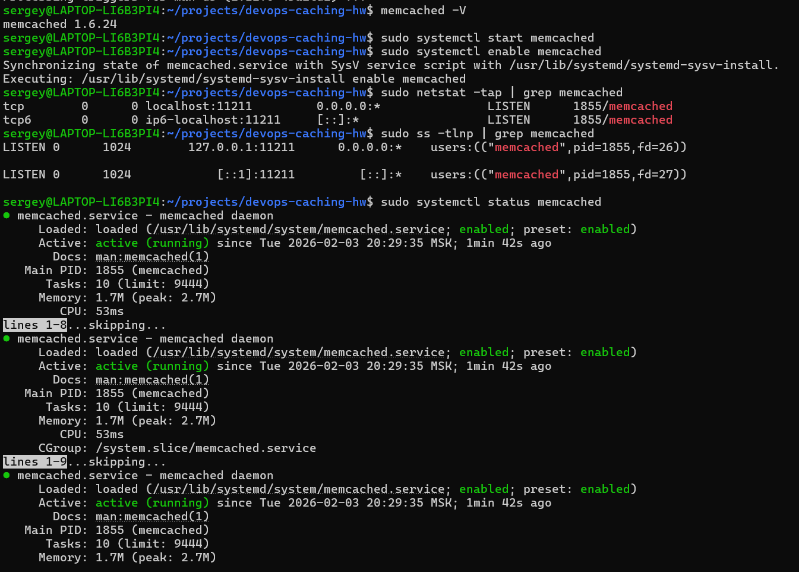
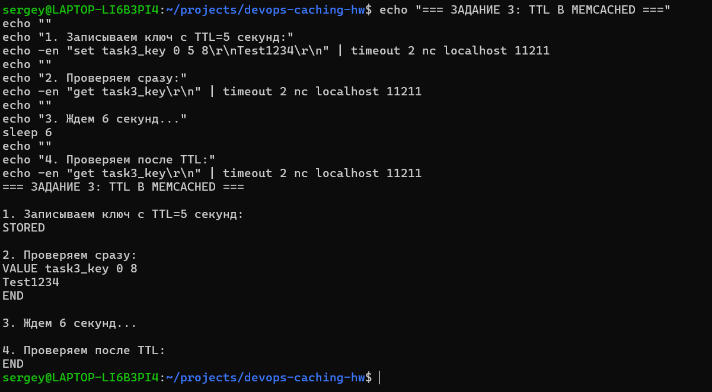
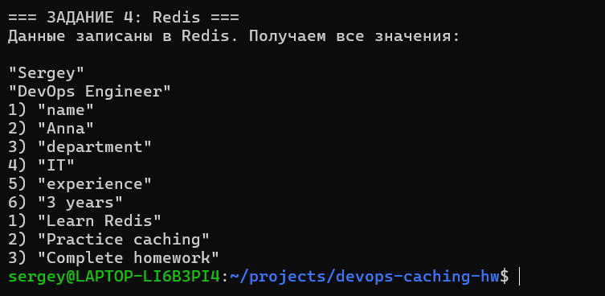

# Домашнее задание по кешированию для DevOps инженера Овсянникова Сергея 

## Задание 1. Кеширование

**Приведите примеры проблем, которые может решить кеширование.**

Кеширование повышает производительность системы за счет расположения в быстром кеше данных, к которым выполняются запросы чаще всего.

**Основные проблемы, которые решает кеширование:**

1. **Высокая задержка (latency) при обращении к медленным источникам данных**
   - Проблема: Пользователи долго ждут загрузки данных из базы данных или внешних API
   - Решение: Часто запрашиваемые данные хранятся в оперативной памяти, доступ к которой в сотни раз быстрее

2. **Высокая нагрузка на базу данных и backend-системы**
   - Проблема: База данных не справляется с большим количеством запросов, особенно во время пиковых нагрузок
   - Решение: Кеш принимает на себя до 80-90% read-запросов, разгружая основную БД

3. **Нестабильность при пиковых нагрузках (трафик-спайки)**
   - Проблема: Система "падает" во время всплесков трафика (распродажи, запуск новых функций)
   - Решение: Кеш сглаживает пики, отдавая заранее закешированные данные

4. **Высокая стоимость вычислительных ресурсов**
   - Проблема: Дорогостоящие вычисления или запросы к платным API выполняются многократно
   - Решение: Результаты вычислений кешируются на определенное время

5. **Низкая отказоустойчивость**
   - Проблема: При сбое базы данных приложение полностью перестает работать
   - Решение: Кеш может временно отдавать устаревшие данные, поддерживая базовую функциональность

## Задание 2. Memcached

**Установите и запустите memcached.**

Memcached успешно установлен и запущен. Статус службы:

## Задание 3. Удаление по TTL в Memcached

**Запишите в memcached несколько ключей с любыми именами и значениями, для которых выставлен TTL 5.**

Ключ `task3_key` со значением `Test1234` был записан с TTL=5 секунд. Через 6 секунд ключ автоматически удалился:

## Задание 4. Запись данных в Redis

**Запишите в Redis несколько ключей с любыми именами и значениями.**

Записаны следующие данные:
- Строковые ключи: `student = "Sergey"`, `profession = "DevOps Engineer"`
- Hash: `employee:1` с полями name, department, experience
- Список: `tasks` с тремя элементами

Все данные успешно получены через redis-cli:

## Выполнение

Все задания выполнены успешно. Установлены и протестированы:
- Memcached с проверкой TTL
- Redis с различными типами данных

Скриншоты результатов находятся в папке `screenshots/`.
